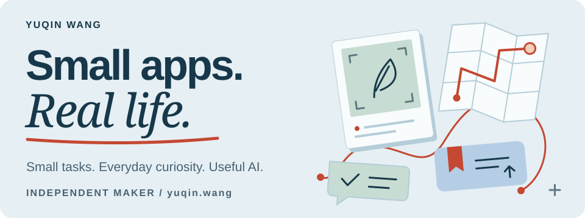
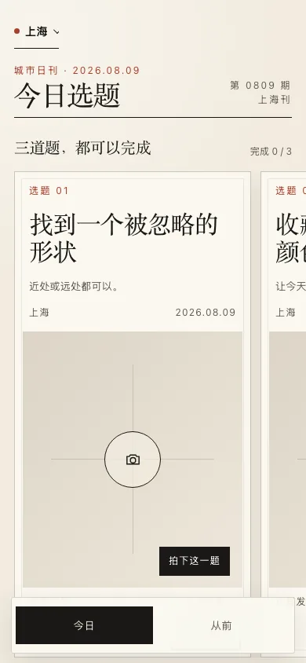
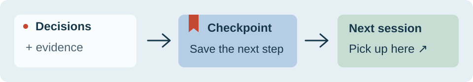

<picture>
  <source media="(prefers-color-scheme: dark)" srcset="assets/maker-dark.svg">
  
</picture>

### 你好，我是王钰钦 / Yuqin

独立产品创作者。我做的东西，往往来自自己想做的一件小事：从普通照片里发现一点知识，换条路逛逛城市，或者让没做完的 AI 任务接着往下走。

**[逛逛我的网站 ↗](https://yuqin.wang/)** &nbsp; · &nbsp; [文章](https://yuqin.wang/#/articles) &nbsp; · &nbsp; [English](README.md)

## 把日常，再看仔细一点

<table>
<tr>
<td width="50%" valign="top">
  <h3><a href="https://github.com/wangyuqin378-cpu/jianwei">见微 / Jianwei</a></h3>
  
相册里，藏着一点新知识。把日常照片变成知识卡，每张卡都能追溯来源。

  
<strong>iPhone · 开发中</strong>

  

  
<a href="https://yuqin.wang/#/project/jianwei"><strong>看看产品 ↗</strong></a> · <a href="https://github.com/wangyuqin378-cpu/jianwei">查看仓库</a>

</td>
<td width="50%" valign="top">
  <h3><a href="https://yuqin.wang/#/project/city">城市副本 / City Copy</a></h3>
  
给散步找一个小理由。跟着每日任务观察城市，拍下发现，再做成自己的城市小志。

  
<strong>iPhone · 开发中</strong>

  

  
<a href="https://yuqin.wang/#/project/city"><strong>看看产品 ↗</strong></a> · 源码私有

</td>
</tr>
</table>

关于这些开发预览

图片来自持续开发中的真实界面。见微公开仓库保留较早的工程快照，不能据此复现图中版本。两个产品的公开下载、最终真机验收和正式分发仍待完成。

## 让有用的工作，接着往下走

### [Context Continuity](https://github.com/wangyuqin378-cpu/context-continuity)

AI 长任务也需要书签。保存已经做出的决定、找到的证据和下一步，让新会话接着做。

<picture>
  <source media="(prefers-color-scheme: dark) and (max-width: 600px)" srcset="assets/continuity-mobile-dark.svg">
  <source media="(max-width: 600px)" srcset="assets/continuity-mobile-light.svg">
  <source media="(prefers-color-scheme: dark)" srcset="assets/continuity-dark.svg">
  
</picture>

**[跟着示例试一次 →](https://github.com/wangyuqin378-cpu/context-continuity/tree/main/examples/quickstart)** &nbsp; · &nbsp; [v2.1.0](https://github.com/wangyuqin378-cpu/context-continuity/releases/tag/v2.1.0) · MIT · Python 3.9+

上图是流程示意。已支持的行为与评测边界见仓库说明。

### 工作台上的其他尝试

- **[Prompt Generation Loop](https://github.com/wangyuqin378-cpu/prompt-generation-loop)** — 从产品目标和坏例出发，生成可测试的 Prompt。*Agent Skill 原型。*
- **[Codex Resume Manager](https://github.com/wangyuqin378-cpu/codex-resume-manager)** — 额度恢复后，继续主动开启守护的原任务。*macOS 本地工具；真实额度中断验收待完成。*
- **[Just Do It](https://github.com/wangyuqin378-cpu/just-do-it)** — 把纪要和零散输入整理成行动与后续事项。*依赖内部服务的工作流实验。*
- **[Texas Hold’em](https://github.com/wangyuqin378-cpu/texas-holdem)** — 给朋友开一桌浏览器牌局，也能和机器人练习。*学习 Demo。*

## 工作台上的新进展

最近的公开开发记录，点进去可以看到具体改动。

<!-- updates:start -->
- 2026-09-16 · **开发更新** · codex-resume-manager — [docs: clarify product purpose, setup and validation status](https://github.com/wangyuqin378-cpu/codex-resume-manager/commit/1e12022628174845928b2596d2a191ca6fa0f8c5)
- 2026-09-16 · **开发更新** · prompt-generation-loop — [docs: clarify product purpose, setup and validation status](https://github.com/wangyuqin378-cpu/prompt-generation-loop/commit/0c7e08dec523e65ad8f7b621ff5d5e6359c2493b)
- 2026-09-16 · **开发更新** · context-continuity — [docs: clarify product purpose, setup and validation status](https://github.com/wangyuqin378-cpu/context-continuity/commit/f3973909f3eb7b317be4424229a29ba1cb75490a)
- 2026-09-16 · **开发更新** · jianwei — [docs: clarify product purpose, setup and validation status](https://github.com/wangyuqin378-cpu/jianwei/commit/476c6f2c43c1f5f3fb48507f2f12c4d1a224d076)
- 2026-08-27 · **开发更新** · jianwei — [Refresh iOS beta handoff evidence](https://github.com/wangyuqin378-cpu/jianwei/commit/7a19a0b544a4975b711131adb89e8bbe77f0b55b)
<!-- updates:end -->

[完整更新 →](UPDATES.md) &nbsp; · &nbsp; [更多作品与故事 ↗](https://yuqin.wang/#/projects)
